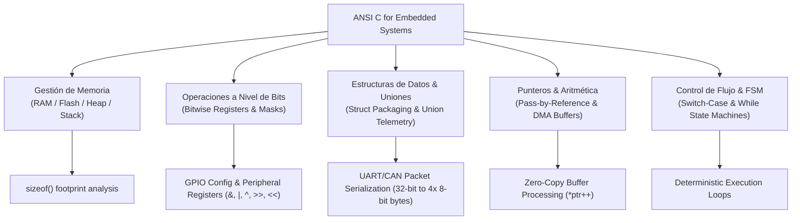

# ⚡ Embedded C Fundamentals (ANSI C for Embedded Systems)

[](https://en.wikipedia.org/wiki/C_(programming_language))
[](https://en.wikipedia.org/wiki/C%2B%2B)
[](https://www.codeblocks.org/)
[](https://gcc.gnu.org/)
[](https://www.udemy.com/share/107Rti3@eRQj9VKbXlKjItGx65mh6I99XTnbwO9ueD2_y6dSKBneA-Nr_WvLklVuKDWJAD7DhA==/)
[](LICENSE)

---

## 📖 Descripción General / Overview

### 🇪🇸 Español
Este repositorio contiene una colección completa, estructurada y documentada de ejercicios prácticos desarrollados durante el curso y certificación de Udemy: **[ANSI C for Embedded Systems](https://www.udemy.com/share/107Rti3@eRQj9VKbXlKjItGx65mh6I99XTnbwO9ueD2_y6dSKBneA-Nr_WvLklVuKDWJAD7DhA==/)**.

Todos los proyectos han sido implementados, probados y verificados con el entorno de desarrollo integrado **Code::Blocks** utilizando el compilador **GCC/MinGW**. Cada ejercicio incluye código fuente limpio, comentarios bilingües explicativos y su archivo de proyecto `.cbp` correspondiente para apertura inmediata en Code::Blocks.

Los temas cubren desde los fundamentos esenciales del lenguaje C hasta conceptos críticos aplicados a sistemas embebidos y microcontroladores:
- Gestión de memoria y operadores de tamaño (`sizeof`)
- Estructuras de control de flujo y máquinas de estado (`if`, `switch-case`, `while`, `for`)
- Modularidad, paso por referencia y punteros (`*`, `&`, `swap`)
- Vectores, matrices, decaimiento de arreglos y aritmética de apuntadores
- Empaquetamiento de datos con estructuras (`struct`)
- Serialización de paquetes de telemetría a nivel de bytes mediante uniones (`union`)
- Códigos de comando y enumeraciones de estado (`enum`)
- Manipulación de registros y compuertas lógicas a nivel de bits (`&`, `|`, `^`, `~`, `>>`, `<<`)
- Algoritmos y proyectos aplicativos (simulador de partido de tenis, convertidores, evaluadores)

---

### 🇬🇧 English
This repository contains a comprehensive, structured, and fully documented collection of practical exercises developed during the Udemy certification course: **[ANSI C for Embedded Systems](https://www.udemy.com/share/107Rti3@eRQj9VKbXlKjItGx65mh6I99XTnbwO9ueD2_y6dSKBneA-Nr_WvLklVuKDWJAD7DhA==/)**.

All projects have been created, tested, and validated in **Code::Blocks IDE** using the **GCC/MinGW** toolchain. Each exercise includes clean source code, bilingual explanatory comments, and its native `.cbp` Code::Blocks project file for seamless 1-click execution.

Topics span from standard C programming fundamentals to low-level microcontroller paradigms:
- Memory footprint & type sizing (`sizeof`)
- Control flow & jump-table state machines (`if`, `switch-case`, `while`, `for`)
- Modular programming, pass-by-reference, and pointers (`*`, `&`, `swap`)
- Arrays, strings, array-to-pointer decay, and pointer arithmetic
- Data encapsulation using structures (`struct`)
- Byte-level telemetry packet serialization using unions (`union`)
- Command codes and state definitions using enumerations (`enum`)
- Bitwise register manipulation and logic masks (`&`, `|`, `^`, `~`, `>>`, `<<`)
- Applied mini-projects (tennis match score simulator, translators, grade analyzers)

---

## 🗂️ Estructura del Repositorio / Repository Structure

```text
embedded-c-fundamentals/
├── 01-fundamentos-tipos-datos_fundamentals-data-types/
│   ├── 01_tipos-datos-tamanios_data-types-and-sizes/
│   ├── 02_operaciones-aritmeticas-basicas_basic-arithmetic-operations/
│   ├── 03_calculo-salario-horas_work-hours-salary/
│   └── 04_calculo-incremento-salarial_salary-raise-calculation/
├── 02-estructuras-control_control-structures/
│   ├── 01_descuentos-cliente-if-else_customer-discounts-if-else/
│   ├── 02_fizzbuzz-algoritmo_fizzbuzz-algorithm/
│   ├── 03_menu-dias-semana-switch_weekday-selector-switch/
│   ├── 04_clasificador-caracteres-switch_char-classifier-switch/
│   ├── 05_evaluacion-condicional-binaria_binary-conditional-check/
│   ├── 06_contador-bucle-while_while-loop-counter/
│   ├── 07_suma-numeros-pares-for_even-numbers-sum-for/
│   ├── 08_suma-acumulada-1-a-100_accumulated-sum-1-to-100/
│   ├── 09_tabla-multiplos-siete_multiples-of-seven-table/
│   ├── 10_cuenta-regresiva-100-a-1_countdown-100-to-1/
│   └── 11_promedio-calificaciones-for_grade-average-accumulator-for/
├── 03-funciones-modularidad_functions-modularity/
│   ├── 01_calculo-cuadrado-funcion_square-calculation-function/
│   ├── 02_calculo-cubo-funcion_cube-calculation-function/
│   ├── 03_suma-modular-procedimientos_modular-addition-procedures/
│   └── 04_intercambio-variables-punteros_pointer-swap-by-reference/
├── 04-arreglos-cadenas_arrays-strings/
│   ├── 01_suma-promedio-arreglo_array-sum-and-average/
│   ├── 02_recorrido-arreglo-puntero_pointer-array-traversal/
│   ├── 03_fusion-dos-arreglos_merge-two-arrays/
│   ├── 04_generador-arreglo-secuencial_sequential-array-generator/
│   └── 05_traductor-leet-speak_leet-speak-translator/
├── 05-punteros-memoria_pointers-memory/
│   ├── 01_referencia-desreferencia-punteros_pointer-ref-and-deref/
│   ├── 02_apuntador-tipo-entero_integer-pointer-assignment/
│   ├── 03_tamanios-memoria-punteros_pointer-memory-sizeof/
│   └── 04_memoria-dinamica-malloc_dynamic-memory-malloc/
├── 06-estructuras-uniones-enum_structs-unions-enums/
│   ├── 01_registro-datos-sensor-struct_sensor-data-record-struct/
│   ├── 02_nomina-trabajadores-struct_worker-payroll-struct/
│   ├── 03_memoria-compartida-union_shared-memory-union/
│   ├── 04_serializacion-gps-union_gps-telemetry-byte-union/
│   ├── 05_estados-comandos-enum_command-states-enum/
│   ├── 06_dias-semana-enum_weekdays-enum/
│   └── 07_palos-baraja-enum_card-suits-enum/
├── 07-operadores-bit-a-bit_bitwise-embedded/
│   ├── 01_compuertas-logicas-bits_bitwise-logic-gates/
│   └── 02_operadores-relacionales_relational-operators/
├── 08-proyectos-aplicativos_applied-projects/
│   ├── 01_simulador-partido-tenis_tennis-match-simulator/
│   └── 02_calculadora-promedio-ponderado_weighted-grade-calculator/
└── 09-bonus-introduccion-cpp_bonus-cpp-intro/
    ├── 01_fundamentos-io-cpp_cpp-io-fundamentals/
    └── 02_clases-metodos-gradebook_classes-methods-gradebook/
```

---

## 📚 Catálogo Detallado de Proyectos / Detailed Project Catalog

### Módulo 1: Fundamentos y Tipos de Datos / Fundamentals & Data Types
| # | Ejercicio / Exercise (ES / EN) | Concepto Clave / Key Concept | Descripción / Description |
|---|---|---|---|
| 01 | `01_tipos-datos-tamanios` / `data-types-and-sizes` | Data Types & `sizeof` | Evaluación de tamaños en bytes de tipos primitivos (char, short, int, long, float, double) y representación en memoria. |
| 02 | `02_operaciones-aritmeticas-basicas` / `basic-arithmetic-operations` | Arithmetic Operators & Casting | Operaciones matemáticas fundamentales (suma, resta, multiplicación, división) y casteo explícito de tipos. |
| 03 | `03_calculo-salario-horas` / `work-hours-salary` | User Input & Computation | Lectura de horas laboradas, cálculo de compensación y salida con formato de moneda. |
| 04 | `04_calculo-incremento-salarial` / `salary-raise-calculation` | Arithmetic Update & Percentages | Cálculo de incremento porcentual (15%) sobre salario base y actualización de estado. |

### Módulo 2: Estructuras de Control de Flujo / Control Flow Structures
| # | Ejercicio / Exercise (ES / EN) | Concepto Clave / Key Concept | Descripción / Description |
|---|---|---|---|
| 01 | `01_descuentos-cliente-if-else` / `customer-discounts-if-else` | Conditional Branching (`if-else`) | Bifurcación múltiple para descuentos escalonados por categoría de cliente (A, B, C). |
| 02 | `02_fizzbuzz-algoritmo` / `fizzbuzz-algorithm` | Modulo Operator (`%`) | Algoritmo clásico FizzBuzz del 1 al 100 evaluando divisibilidad entre 3, 5 y 15. |
| 03 | `03_menu-dias-semana-switch` / `weekday-selector-switch` | Switch Jump Tables | Mapeo de enteros a días de la semana con control de casos por defecto (`default`). |
| 04 | `04_clasificador-caracteres-switch` / `char-classifier-switch` | Character Analysis & Fallthrough | Clasificación de caracteres en vocales, consonantes, números y símbolos con `switch`. |
| 05 | `05_evaluacion-condicional-binaria` / `binary-conditional-check` | Boolean Flags & Conditions | Validación de estados binarios activos/inactivos mediante banderas numéricas. |
| 06 | `06_contador-bucle-while` / `while-loop-counter` | While Loops & Iterators | Estructuras de repetición con condición previa y control de iteraciones. |
| 07 | `07_suma-numeros-pares-for` / `even-numbers-sum-for` | Custom Loop Steps (`i += 2`) | Acumulación de enteros pares en el rango [2, 100] con salto aritmético de paso 2. |
| 08 | `08_suma-acumulada-1-a-100` / `accumulated-sum-1-to-100` | Loop Accumulation & Gauss Sum | Suma lineal de 1 a 100 con validación analítica de la fórmula de Gauss ($5050$). |
| 09 | `09_tabla-multiplos-siete` / `multiples-of-seven-table` | Arithmetic Progression | Generación iterativa de múltiplos de 7 en el intervalo de 7 a 77. |
| 10 | `10_cuenta-regresiva-100-a-1` / `countdown-100-to-1` | Loop Decrement (`i--`) | Conteo regresivo hacia atrás de 100 a 1 con saltos de línea formateados. |
| 11 | `11_promedio-calificaciones-for` / `grade-average-accumulator-for` | Interactive Loop Accumulation | Entrada interactiva de N calificaciones, sumatoria acumulativa y cálculo de promedio. |

### Módulo 3: Funciones y Modularidad / Functions & Modularity
| # | Ejercicio / Exercise (ES / EN) | Concepto Clave / Key Concept | Descripción / Description |
|---|---|---|---|
| 01 | `01_calculo-cuadrado-funcion` / `square-calculation-function` | Function Prototyping & Return | Prototipado y definición de la función `cuadrado(base)` con paso por valor. |
| 02 | `02_calculo-cubo-funcion` / `cube-calculation-function` | Type Widening (`long`) | Cálculo de potencias cúbicas con tipo `long` para mitigar desbordamientos. |
| 03 | `03_suma-modular-procedimientos` / `modular-addition-procedures` | Void Procedures & Pointer Return | Procedimientos modulares que escriben resultados directamente en memoria destino. |
| 04 | `04_intercambio-variables-punteros` / `pointer-swap-by-reference` | Pass-by-Reference & `swap` | Intercambio de dos variables en memoria física mediante punteros (`swap(&a, &b)`). |

### Módulo 4: Arreglos y Cadenas / Arrays & Strings
| # | Ejercicio / Exercise (ES / EN) | Concepto Clave / Key Concept | Descripción / Description |
|---|---|---|---|
| 01 | `01_suma-promedio-arreglo` / `array-sum-and-average` | 1D Arrays & Traversal | Declaración de vectores, iteración indexada, suma total y promedio. |
| 02 | `02_recorrido-arreglo-puntero` / `pointer-array-traversal` | Pointer Arithmetic (`*(ptr++)`) | Recorrido eficiente de arreglos mediante desplazamiento de punteros en memoria. |
| 03 | `03_fusion-dos-arreglos` / `merge-two-arrays` | Array Concatenation | Concatenación secuencial de dos sub-arreglos de 5 elementos en un arreglo de 10. |
| 04 | `04_generador-arreglo-secuencial` / `sequential-array-generator` | Array Population & Grid Format | Generación automática de 100 enteros secuenciales e impresión tabular en 10 columnas. |
| 05 | `05_traductor-leet-speak` / `leet-speak-translator` | String Tables & Ciphers | Traductor alfanumérico a lenguaje Hacker/Leet (1337) mediante tabla de cadenas constantes. |

### Módulo 5: Punteros y Gestión de Memoria / Pointers & Memory Management
| # | Ejercicio / Exercise (ES / EN) | Concepto Clave / Key Concept | Descripción / Description |
|---|---|---|---|
| 01 | `01_referencia-desreferencia-punteros` / `pointer-ref-and-deref` | Operators `&` (Address) and `*` (Value) | Asignación de direcciones, inspección de punteros y mutación indirecta de datos. |
| 02 | `02_apuntador-tipo-entero` / `integer-pointer-assignment` | Typed Pointer Reassignment | Punteros a tipos enteros cortos (`short*`) y reasignación dinámica de objetivos. |
| 03 | `03_tamanios-memoria-punteros` / `pointer-memory-sizeof` | Array Decay & Pointer Sizes | Diferencia fundamental entre `sizeof(arr)`, `sizeof(arr+1)`, `sizeof(*arr)` y `sizeof(ptr)`. |
| 04 | `04_memoria-dinamica-malloc` / `dynamic-memory-malloc` | Heap Management (`malloc`/`free`) | Asignación dinámica en memoria Heap, validación de puntero nulo y liberación segura. |

### Módulo 6: Estructuras, Uniones y Enumeraciones / Structs, Unions & Enums
| # | Ejercicio / Exercise (ES / EN) | Concepto Clave / Key Concept | Descripción / Description |
|---|---|---|---|
| 01 | `01_registro-datos-sensor-struct` / `sensor-data-record-struct` | Structs & Embedded Telemetry | Estructura para empaquetar variables de sensores (azimut, pitch superior e inferior). |
| 02 | `02_nomina-trabajadores-struct` / `worker-payroll-struct` | Nested Arrays inside Structs | Estructura de registro laboral con campos de texto y arreglo interno de sueldos diarios. |
| 03 | `03_memoria-compartida-union` / `shared-memory-union` | Shared Memory Overlap | Demostración del comportamiento de uniones donde los miembros comparten memoria. |
| 04 | `04_serializacion-gps-union` / `gps-telemetry-byte-union` | Byte-level Telemetry Serialization | Conversión de coordenada GPS de 32 bits a arreglo de 4 bytes para transmisión UART/CAN. |
| 05 | `05_estados-comandos-enum` / `command-states-enum` | Explicit Enums & State Codes | Máquina de estados y códigos de comando con valores explícitos (`CERRAR = 50`). |
| 06 | `06_dias-semana-enum` / `weekdays-enum` | Enum Type & Enum Arithmetic | Definición tipada de días de la semana y operaciones de desplazamiento sobre constantes. |
| 07 | `07_palos-baraja-enum` / `card-suits-enum` | Implicit Sequential Enums | Enumeraciones secuenciales implícitas de 0 a N para categorización de elementos. |

### Módulo 7: Operadores a Nivel de Bits / Bitwise & Logic Operators
| # | Ejercicio / Exercise (ES / EN) | Concepto Clave / Key Concept | Descripción / Description |
|---|---|---|---|
| 01 | `01_compuertas-logicas-bits` / `bitwise-logic-gates` | Bitwise (`&`, `|`, `^`, `>>`, `<<`) | Operaciones a nivel de bits con máscaras binarias para registros de microcontrolador. |
| 02 | `02_operadores-relacionales` / `relational-operators` | Relational Truth Table | Evaluación lógica y valores booleanos de operadores relacionales (`==`, `!=`, `<`, `>`). |

### Módulo 8: Proyectos Aplicativos / Applied Projects
| # | Ejercicio / Exercise (ES / EN) | Concepto Clave / Key Concept | Descripción / Description |
|---|---|---|---|
| 01 | `01_simulador-partido-tenis` / `tennis-match-simulator` | Full Match State Machine | Simulador algorítmico de tanteador de tenis (0, 15, 30, 40, Deuce, Ventaja y Victoria). |
| 02 | `02_calculadora-promedio-ponderado` / `weighted-grade-calculator` | Academic Grade System | Evaluador académico con reporte formateado y dictamen de aprobación ($>= 6.0$). |

### Módulo 9: Bonus - Introducción a C++ / Bonus - C++ Introduction
| # | Ejercicio / Exercise (ES / EN) | Concepto Clave / Key Concept | Descripción / Description |
|---|---|---|---|
| 01 | `01_fundamentos-io-cpp` / `cpp-io-fundamentals` | Streams `std::cin` & `std::cout` | Introducción al flujo de entrada/salida y espacios de nombres (`namespace std`). |
| 02 | `02_clases-metodos-gradebook` / `classes-methods-gradebook` | OOP: Classes, Getters & Setters | Programación orientada a objetos: clase `GradeBook`, encapsulamiento y métodos `const`. |

---

## 🛠️ Cómo Ejecutar los Proyectos / How to Run the Projects

### Opción 1: Con Code::Blocks IDE (Recomendado / Recommended)
1. Descarga e instala **[Code::Blocks](https://www.codeblocks.org/)** (se recomienda la versión con MinGW integrado).
2. Clona este repositorio:
   ```bash
   git clone https://github.com/DanyGhostt/embedded-c-fundamentals.git
   ```
3. En Code::Blocks, ve a **File -> Open...** y selecciona el archivo `.cbp` del ejercicio deseado (ej. `Simulador_Partido_Tenis.cbp`).
4. Presiona **F9** (o el botón **Build and Run**) para compilar y ejecutar el proyecto.

---

### Opción 2: Desde la Terminal con GCC / Command Line with GCC
Puedes compilar y ejecutar directamente cualquier ejercicio desde la terminal:

```bash
# Ejemplo: Compilar y ejecutar el simulador de tenis en C
cd 08-proyectos-aplicativos_applied-projects/01_simulador-partido-tenis_tennis-match-simulator
gcc -Wall -O2 main.c -o tenis_sim
./tenis_sim

# Ejemplo: Compilar y ejecutar el ejercicio de C++
cd ../../09-bonus-introduccion-cpp_bonus-cpp-intro/02_clases-metodos-gradebook_classes-methods-gradebook
g++ -Wall -O2 main.cpp -o gradebook
./gradebook
```

---

## 💡 Conceptos Clave para Sistemas Embebidos / Key Embedded Concepts



1. **Memoria y Eficiencia (`sizeof` y tipos exactos)**: En microcontroladores con recursos limitados (e.g. 16KB-64KB RAM), el tamaño y alineamiento de variables determina la viabilidad del firmware.
2. **Manipulación de Bits**: Modificar registros de periféricos (`TIMERS`, `ADC`, `GPIO`, `UART`) sin alterar bits adyacentes mediante máscaras `PORT |= (1 << PIN)` y `PORT &= ~(1 << PIN)`.
3. **Serialización con Uniones (`union`)**: Conversión instantánea sin copias de variables multitipo (ej. float o long de 32 bits a 4 bytes independientes) para transmisiones serie sobre UART, SPI, I2C y CAN.
4. **Punteros y Paso por Referencia**: Pasar direcciones de memoria en lugar de duplicar estructuras pesadas en el Stack, optimizando ciclos de reloj y memoria disponible.

---

## 👤 Autor / Author

- **Juan Daniel Pérez ([@DanyGhostt](https://github.com/DanyGhostt))**
- Certificación: [ANSI C for Embedded Systems (Udemy)](https://www.udemy.com/share/107Rti3@eRQj9VKbXlKjItGx65mh6I99XTnbwO9ueD2_y6dSKBneA-Nr_WvLklVuKDWJAD7DhA==/)
- IDE & Herramientas: Code::Blocks, GCC / MinGW, Git & GitHub.

---

## 📄 Licencia / License

Este repositorio se distribuye bajo la licencia [MIT](LICENSE). Siéntete libre de utilizar estos códigos como referencia de estudio o base para tus proyectos embebidos.
